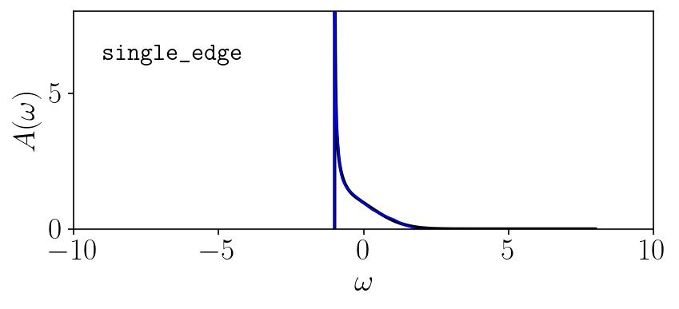
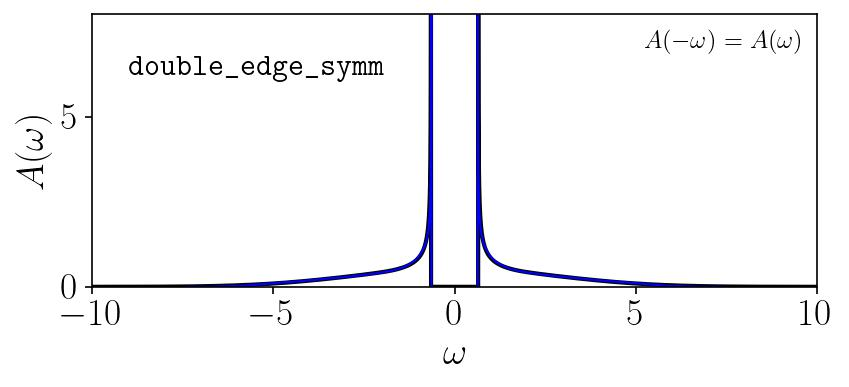
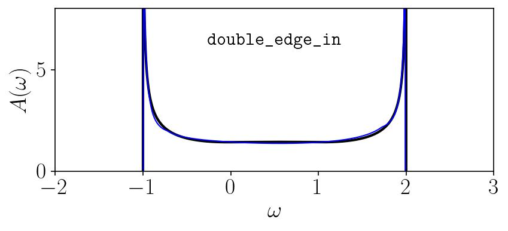

## Instructions for running the power-law edge constrained parameterization

### Set SAC parameters 
Set the parameters for the SAC run in `in_edge.in`. The inputs are:

|in_edge.in|
|---|
|N_e, N_c: number of δ's in monotonic edge part of spectrum, number of δ's in continuum part of spectrum|
|ω_0, ω_m, δω, δω_h: lower ω bound, upper ω bound, ω spacing, ω spacing for output spec|
|p, A_c, A_r: power in edge singularity, (ω-ω1)^{-p}, spectral weight of continuum ∈ [0, 1), spectral weight of rightward decaying edge ∈ [0, 1]|
|θ_0, f_anneal, N_anneal, a: initial sampling temp, temperature reduction factor for main anneal,  Number of anneal steps, a for theta criterion for output spectrum|
|anneal_steps, sample_steps, bins:, number of sweeps per anneal step, number of sweeps in final sampling, number of bins of anneal_steps sweeps per anneal step |
|input_file, output folder: prepared filed containing QMC G(τ) data, directory to write output of SAC program to|
|fix_edge, kernel type: whether sample edge (0) or fix it to value (by setting fix_edge = #), which type of kernel to use when converting A(ω) to G(τ) ('zeroT' or 'finiteT')|
|mode: which type of edge spectrum to resolve ('single_edge', 'double_edge_symm', 'double_edge_in'), see examples below|

This `in_edge.in` file should be in the same directory as `sac_edge.jl`. See provided `in_edge.in` file for example parameters.

For this verion of the program, the user must set the *kernel type*:

### Kernel Types

| Type | Transform  | Notes |
|-----------|----------------|----|
| `zeroT` | $G(\tau) = \int_{-\infty}^{\infty} d\omega   e^{-\tau \omega }  A(\omega)$ | All modes can be run. |
| `finiteT`  | $G(\tau) = \int_{-\infty}^{\infty} d\omega  \frac{e^{-\tau \omega } }{1 + e^{-\beta \omega}}A(\omega)$ | All modes can be run. |
| `bosonic`    | $G(\tau) = \int_{-\infty}^{\infty} d\omega  e^{-\tau \omega } A(\omega) =   \int_{0}^{\infty} d\omega   \left(e^{-\tau \omega } + e^{-(\beta - \tau) \omega } \right)  A(\omega)$ | $A(-\omega) = e^{-\beta \omega} A(\omega)$ enforced explicitly and only positive frequency axis sampled. Foir this kernel, only the `single_edge` mode can be run. |

The user also must set the *mode* (which type of edge spectrum to resolve). The names of the modes and examples of the spectra they produce, using artificial spectra (black) and synthetic QMC data, are shown below (blue).

#### Examples:

`single_edge` mode:

`double_edge_symm` mode:

`double_edge_in` mode:

### Run SAC
The program is run by executing:

`julia sac_edge.jl`

