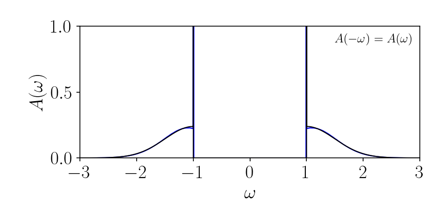

# sac - Julia code to run the Stochastic Analytic Continuation Method
Currently supports unconstrained sampling, the $\delta$-function edge parameterization, and the monotonic edge constrained parameterization for fermionic or bosonic spectral functions.

## Instructions for running delta-edge sampling

### Set SAC parameters 
Set the parameters for the SAC run in `in_peak.in`. The inputs are:

|in_peak.in|
|---|
|N_ω, N_p: number of δ's in continuum, number of δ's in peak|
|A_0, ω_m, δω, δω_h: weight of macroscopic delta edge(s), upper ω bound, ω spacing, ω spacing for output spec|
|θ_0, f_anneal, a_criterion: initial sampling temp, temperature reduction factor for main anneal,  a value for theta criterion|
|N_anneal, anneal_steps, sample_steps: Number of anneal steps, number of sweeps per anneal step in main anneal, number of sweeps per anneal step in final anneal|
|G_file, output folder: name of input G(tau) file, name of output file|
|symm, kernel type: whether to enforce A(-omega) = A(omega) (1) are sample A(omega) across the full freq. axis (0), which type of kernel to use when converting A(ω) to G(τ) ('zeroT' or 'finiteT' or 'bosonic')|

This `in_peak.in` file must be in the same directory as `sac_peak.jl`. See provided `in_peak.in` file for example parameters.

For this version of the program, the user must set the *kernel type*:

### Kernel Types

| Type | Transform  | Notes |
|-----------|----------------|----|
| `zeroT` | $G(\tau) = \int_{-\infty}^{\infty} d\omega   e^{-\tau \omega }  A(\omega)$ | $A(-\omega) = A(\omega)$ or $A(-\omega) \neq A(\omega)$  |
| `finiteT`  | $G(\tau) = \int_{-\infty}^{\infty} d\omega  \frac{e^{-\tau \omega } }{1 + e^{-\beta \omega}}A(\omega)$ | $A(-\omega) = A(\omega)$ or $A(-\omega) \neq A(\omega)$  |
| `bosonic`    | $G(\tau) = \int_{-\infty}^{\infty} d\omega  e^{-\tau \omega } A(\omega) =   \int_{0}^{\infty} d\omega   \left(e^{-\tau \omega } + e^{-(\beta - \tau) \omega } \right)  A(\omega)$ | $A(-\omega) = e^{-\beta \omega} A(\omega)$ enforced explicitly and only positive frequency axis sampled |

If `symm = 0` and you are not using the bosonic kernel, then the macroscopic $\delta$ weight `A_0` represents the combined weight of the $\delta$-functions on the positive and negative frequency axes. The sampling will include updates that transfer weight between the positive and negative peaks, as well as the positive and negative continua.

#### Examples:
(Artificial spectrum shown in black and SAC spectrum in blue.)

Symmetric fermionic spectral function:

<!-- 
Non-symmetric fermionic spectral function:

 -->

### Run SAC
The program is run by executing:

`julia sac_peak.jl`

